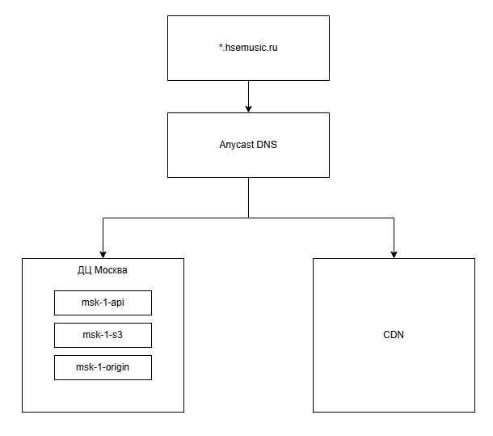
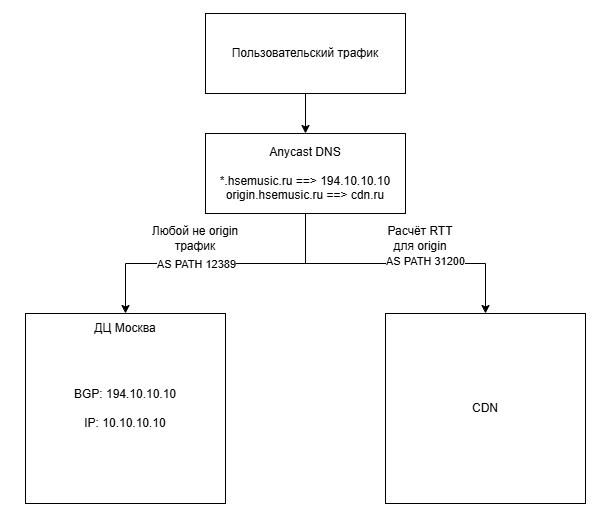
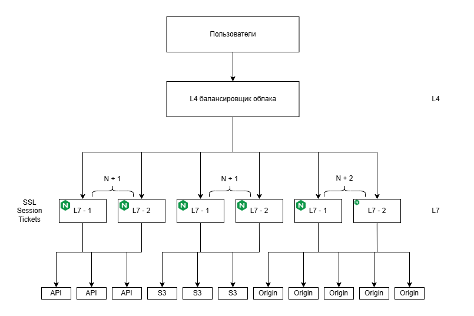
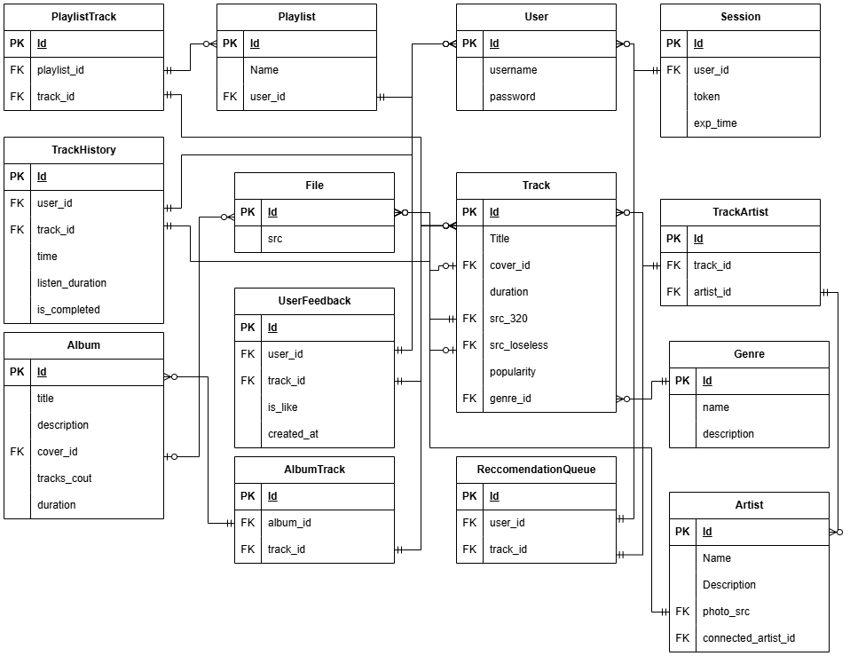
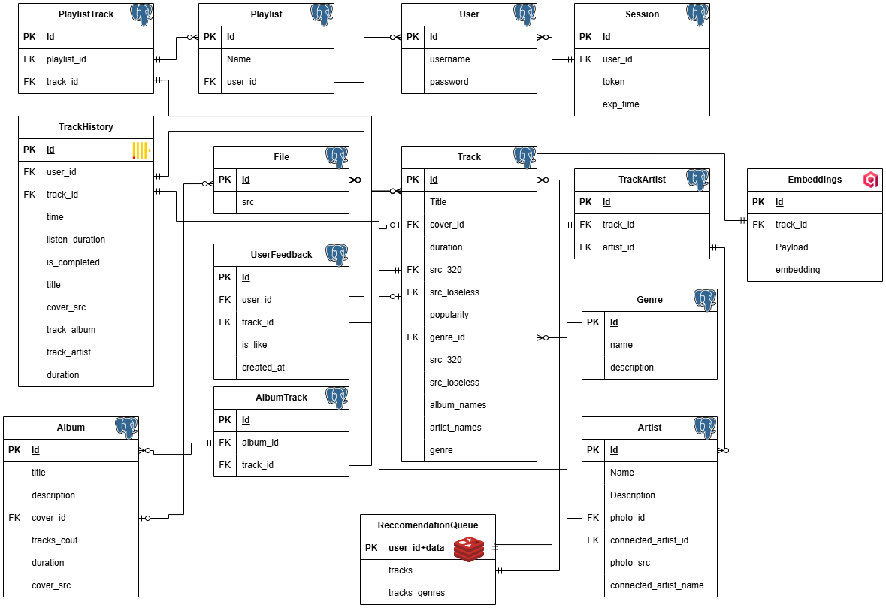

# Расчётно пояснительная записка сервиса для стриминга музыки

# 1 Тема и целевая аудитория

## 1.1 Описание и аналоги
### 1.1.1 Описание
Сервис для стриминга музыки – онлайн сервис, позволяющий пользователям слушать музыку в режиме реального времени, без скачивания треков к себе на устройство.
Сервис предоставляет систему рекомендаций, позволяющий найти пользователю треки, которые соответствуют его предпочтениям.

### 1.1.2 Существующие аналоги

В мире существует несколько аналогичных сервисов, среди них: Spotify, Яндекс Музыка, VK музыка.

## 1.2 Аудитория
### 1.2.1 Описание аудитории 

Основная аудитория – российские пользователи в возрасте от 16 до 50 лет, где на пользователей до 35 лет приходится не менее 60% охвата, как у аналогов сервиса, в соответсвии исследованием 2024 года [1](#список-источников)

### 1.2.2 Местоположение аудитории

Большая часть пользователей находится на территории Российской Федерации

### 1.2.3 Размер аудитрии

Согласно официальным финансовым отчётам Яндекса [2](#список-источников) аудитория сервиса стостовляет 30.5 миллионов человек, что будет являться основой в моём случае

## 1.3 Функциональные требования
### 1.3.1 Основной функционал

Функционал в целом схож с аналогами, например Яндекс музыкой [3](#список-источников). Среди него можно выделить:
 * Прослушивание музыки
 * Система рекомендаций, основанная на лайках, дизлайках и предпочтениях других пользователей
 * Добавление трека в "Сохранённое"
 * Формирование плейлиста
 * Проставление лайков и дизлайков
 * Просмотр плейлистов пользователей
 * Создание странички автора и загрузка собственных треков

### 1.3.2 Ключевые продуктовые решения

* Основный кейсом использования - прослушивание персонализированной подборки
* Создание плейлистов на основе прослушенных треков
* Возможность стать автором

### 1.3.3 Работа системы рекомендаций

Планируется использование коллаборативной фильтрации совместо HNSW алгоритмос (векторное расстояние). В HNSW вектор – набор заранее определённых тегов, которым трек соответствует или нет

## 1.4 Список источников

1. [Исследование аудитории стриминговых сервисов в России](https://adindex.ru/news/researches/2024/12/2/327867.phtml)
2. [Финансовый отчёт Яндекс за 3 квартал 2025 год](https://yastatic.net/s3/ir-docs/docs/2025/q3/25b90c11d0060d861ec0957dbbb96eeb/%D0%98%D0%BD%D1%84%D0%BE%D0%B3%D1%80%D0%B0%D1%84%D0%B8%D0%BA%D0%B0_3_%D0%BA%D0%B2_2025_060d.jpg)
3. [Документация Яндекс музыки](https://yandex.ru/support/music/ru/)

# 2 Расчёт нагрузки

## 2.1 Продуктовые метрики

| Метрика |  Значение  |                                  Комментарий |
| :------ | :--------: | -------------------------------------------: |
| MAU     |  30.5 млн  |                  Месячная активная аудитория |
| DAU     |  5.7 млн   |                   Дневная активная аудитория |
| SF      |   18.6 %   |                        Коэффициент липучести |
| СРХ     | 1211 строк |     Количество записей в БД для пользователя |
| СРХ     |   38 Кб    | Размер хранилища для отдельного пользователя |
| СКД     |     53     |     Среднее количество действий пользователя |

### 2.1.2 Расчёт MAU, DAU и SF

Статистика по ежемесячным и ежедневным активным пользователям бралась из активных источников [[1](#список-источников)] и [[2](#список-источников)].
Sticky Factor (коэффициент липучести) считался как:

$$
  SF=\frac{DAU}{MAU}
$$

### 2.1.3 Средний размер хранилища пользователя

Предполагается хранение истории прослушивания пользователя за последние 7 дней. Из исследования [[3](#список-источников)] получаем, что в среднем люди слушают 20.7 часов музыки в неделю.
В источнике [[4](#список-источников)] указано среднее время прослушивания для различныхх возрастных категорий. В нашем случае получаем среднее время прослушивания в соответсвии с ожидаемым распределением аудитории (расчёт в минутах):

$$
  \frac{3.51 + 3.7}{2} * 0.6 + 3.81 * 0.4 = 3.69
$$

Из расчёта, что за неделю у пользователя все треки уникальны, получаем:

$$
  \frac{20.7 * 60}{3.69} = 336
$$

Для каждого пользователя надо хранить не менее 336 строк в базе данных, содержащих информацию об недавно прослушанных треках.

Кроме того, нужно учесть лайки и дизлайки пользователя для конкретных треков. Если взять коэффициент вовлечённости в 5% и посчитать количество оценённых треков за год, то получится:

$$
  \frac{52 * 20.7 * 60}{3.69} * 0.05 = 875
$$

Итого, получаем необходимость хранить для каждого пользователя не менее 1211. При среднем размере одной строки в 32 байта, получаем объём в 38 Кб

### 2.1.4 Среднее количество действий пользователя

Оформим различные действия в виде сводной таблицы:

| Действие                    | Среднее количество действий | Пиковое количество действий |
| :-------------------------- | :-------------------------: | --------------------------: |
| Загрузка главной страницы   |              2              |                           5 |
| Загрузка информации о треке |             48              |                         120 |
| Проставление оценки         |              2              |                           5 |
| Поиск трека                 |              1              |                           3 |
| Всего                       |             53              |                         133 |

## 2.2 Технические метрики
### 2.2.1 Размер хранения

Из источника [[5](#список-источников)] можно получить информацию, что у аналогичной платформы (Яндекс Музыка) размер каталога не менее 75 млн треков. Из источников [[6](#список-источников)] и [[7](#список-источников)] можно получить информацию о распределении битрейта у разных треков. Стоит учитывать, что у некоторых треков имеется сразу несколько битрейтов (например FLAC и MP3).

Учитывая распределение, произведём подсчёт размера хранилища, необходимого для хранения всего каталога музыки (среднее время трека 4 минуты):

$$
  T = 4 * 60 * 75000000 \\
  0.27 * 1400 * T + 0.95 * 240 * T + 0.02 * 320 * T + 0.016 * 128 * T  + 0.014 * 192 * T \approx 1389\ Тб
$$

Также посчитаем размер метаданных, которые необходимо хранить (в среднем не более 300 байт на трек):

$$
  300 * 75000000 \approx 21 \ Гб
$$

Итого, получаем таблицу:

|                         | Размер, Шт | Размер, Тб |
| :---------------------- | :--------: | :--------: |
| Треки                   |  75000000  |    1389    |
| Метаданные              |  75000000  |   0.0021   |
| Статические медиафайлы  |  75000000  |    179     |
| Пользовательские данные |  30000000  |    1.06    |

### 2.2.2 Сетевой трафик

Для расчёта сетевого трафика, необходимо подсчитать размер данный, которые будут передаваться за секунду. Будем считать, что битрейт каждого трека равен 240, тогда:

$$
  Q = \frac{20.7}{7} * 3600 * 240 \\
   ⠀\\
  \frac{DAU * Q}{86400} = \frac{5.7 * 10^6 * 2554971.43}{86400} \approx 157 \ Гбит/с
$$

Для расчёта пикового потребления возьмём пиковый коэффициент равный 2.5:

$$
  157 * 2.5 = 392.5 \ Гбит/с
$$

| Стандартная нагрузка, Гбит/с | Пиковая нагрузка, Гбит/с | Суточный, Гб |
| :--------------------------- | :----------------------: | -----------: |
| 157                          |          392.5           |      1814400 |

### 2.2.3 RPC

Таблица количества запросов на основные действия:

| Действие                  | Количество запросов |                                                                  Примечание |
| :------------------------ | :-----------------: | --------------------------------------------------------------------------: |
| Загрузка трека            |          3          | Необходимо получить метаданные трека (векторный поиск) + обложку + сам трек |
| Загрузка главной страницы |          2          |                          Информация о пользователе + плейлисты пользователя |
| Проставление оценки       |          1          |                                          Внести информацию о лайке/дизлайке |
| Поиск трека               |          4          |                      Список треков + список альбомов + метаданные + обложки |

На основе этих данных считаем стандартный и пиковый RPC

$$
  RPC = \frac{5.7 * 10^6 * (3 * 48 + 2 * 2 + 1 * 2 + 4)}{24 * 3600} \approx 10160
$$

| Действие                  | Запросы в день |  RPC  | RPC peak |
| :------------------------ | :------------: | :---: | -------: |
| Загрузка трека            |   820.8 млн    | 9500  |    19000 |
| Загрузка главной страницы |    22.8 млн    |  264  |      528 |
| Проставление оценки       |    11.4 млн    |  132  |      264 |
| Поиск трека               |    22.8 млн    |  264  |      528 |
| Всего                     |     900.6      | 10160 |    25400 |

## 2.3 Список источников
1. [Финансовый отчёт Яндекс за 4 квартал 2025](https://yastatic.net/s3/ir-docs/docs/2025/q4/fc756ee95baa6fa171ee77ac733d52be/%D0%98%D0%BD%D1%84%D0%BE%D0%B3%D1%80%D0%B0%D1%84%D0%B8%D0%BA%D0%B0_4_%D0%BA%D0%B2_2025.png)
2. [Исследование месячной и дневной аудитории сервисов в РФ](https://mediascope.net/data/)
3. [Среднее время прослушивание музыки пользователями стриминговых сервисов](https://www.ifpi.org/ifpis-global-study-finds-were-listening-to-more-music-in-more-ways-than-ever/#:~:text=11th%20December%202023-,IFPI's%20global%20study%20finds%20we're%20listening%20to%20more,in%20more%20ways%20than%20ever&text=11th%20December%202023%20%E2%80%93%20IFPI%2C%20representing,songs%20per%20week%20in%202023.)
4. [Средняя длина трека](https://www.statsignificant.com/p/whats-the-perfect-song-length-a-statistical)
5. [Размер каталога треков Яндекс музыки](https://www.rbc.ru/technology_and_media/02/11/2024/67259ef99a79472b3a87096a)
6. [Используемый битрейт в Яндекс музыке](https://yandexmusic.userecho.ru/communities/45/topics/2594-informatsiya-ryadom-s-trekom-ves-format-bitrejt)
7. [Исследование используемых битрейтов в Яндекс музыке](https://habr.com/ru/articles/837700/)

# 3 Глобальная балансировка нагрузки

## 3.1 Функционально разбиение нагрузки

### 3.1.1 Действий на запросы

| Действие                  |                     Запрос                     |               Описание запроса                |                                                            Ограничения / особенности |
| :------------------------ | :--------------------------------------------: | :-------------------------------------------: | -----------------------------------------------------------------------------------: |
| Загрузка трека            |                  Подбор трека                  | Векторный поиск по предпочтениям пользователя | Допустимо использование несколько устаревшей информации о предпочтениях пользователя |
|                           |              Получение метаданных              |            Запрос на чтение из БД             |                                              информации о предпочтениях пользователя |
|                           |               Получение обложки                |       Запрос к отдельному S3 хранилищу        |                                                                                      |
|                           |                Получение трека                 |    Длительный TCP запрос к медиахранилищу     |                    В рамках установившегося соединения нельзя изменить битрейт трека |
| Загрузка главной страницы |      Получение информации о пользователе       |            Запрос на чтение из бд             |                                  Данные должны быть синхронизированы между серверами |
|                           | Получение информации о плейлистах пользователя |            Запрос на чтение из бд             |                                  Данные должны быть синхронизированы между серверами |
| Проставление оценки       |           Проставление оценки треку            |                  Запись в бд                  |                                         Допустима временная несогласованность данных |
| Поиск трека               |            Поиск треков по названию            |                  Поиск в бд                   |                                                                                      |
|                           |           Поиск альбомов по названию           |                  Поиск в бд                   |                                                                                      |
|                           |              Загрузка метаданных               |            Запрос на чтение из бд             |                                                                                      |
|                           |                Загрузка обложек                |            Запрос к отдельному S3             |                                                                                      |

### 3.1.2 Разбиение по доменам

| Запрос                              |              Домен |
| :---------------------------------- | -----------------: |
| Подбор трека                        |    api.hsemusic.ru |
| Получение метаданных                |    api.hsemusic.ru |
| Получение обложки                   |     s3.hsemusic.ru |
| Получение трека                     | origin.hsemusic.ru |
| Получение информации о пользователе |    api.hsemusic.ru |
| Проставление оценки треку           |    api.hsemusic.ru |
| Поиск треков по названию            |    api.hsemusic.ru |
| Поиск альбомов по названию          |    api.hsemusic.ru |

## 3.2 Расположение ДЦ

Решено использовать два датацентра: 1 в **Москве** и **CDM**

Причина использования одного датацентра и CDN является необходимость повысить скорость загрузки треков, при этом обеспечив единый центр хранения информации о пользователях и их предпочтениях. Так как эти данные не обновляются часто, высокая задержка между восточной и заподной частями России не скажутся негативно на пользовательсом опыте.

| Метрика                            |                                                                                                                  Влияние |
| :--------------------------------- | -----------------------------------------------------------------------------------------------------------------------: |
| DAU                                | Уменьшение задержки поиска и получения треков позитивно влияет на DAU, за счёт повышения удовлетворённости пользователей |
| SF                                 |                                 Быстрая загрузка музыки увеличит желание пользователей возвращаться в сервис каждый день |
| Время начала воспроизведения трека |                                          Чем меньше задержка - тем меньше времени пользователь ждёт перед запуском трека |

## 3.3 Распределение запросов по датацентрам

Вся информация, кроме треков и графики будет получаться с единого датацентра. Запросы на получения трека будут разделены между московским датацентром и CDN. Так как около 60% жителей РФ живут в её европейской части, то на CDN будет приходится только около 40% трафика.

| Запрос                              |  RPS  | RPS peak |       Сервер |
| :---------------------------------- | :---: | :------: | -----------: |
| Получение метаданных                | 3234  |   8086   |    msk-1-api |
| Получение обложки                   | 2587  |   6468   |     msk-1-s3 |
|                                     |  647  |   1618   |    cdn-1-api |
| Получение трека                     | 2534  |   6335   | msk-1-origin |
|                                     |  634  |   1585   | cdn-1-origin |
| Получение информации о пользователе |  133  |   333    |    msk-1-api |
| Проставление оценки треку           |  133  |   333    |    msk-1-api |
| Поиск треков по названию            |  67   |   168    |    msk-1-api |
| Поиск альбомов по названию          |  67   |   158    |    msk-1-api |

## 3.4 Схема DNS балансировки

## 3.5 Схема Anycast балансироки

## 3.6 Механизм регулировки трафика между датацентрами

От регистрации своей AS решено отказаться. AS Path Prepending будет использоваться при возможности его оперативного изменения хостинг-провайдером, при возникающих перегрузках или отказов.

# 4 Локальная балансировка нагрузки

## 4.1 Схема балансировки нагрузки

## 4.2 Пояснение к схеме

Так как большинство облачных провайдеров предоставляют услуги по балансировке L4, было решено отказаться от использования своих L4 балансировщиков. Однако всё ещё решено использовать L7 балансировщики. Для оптимизации работы с SSL, решено использовать механизм SSL Session Tickets с унифицированным ключём на всех балансировщиках. Ключ будет обновляться раз в сутки для организации безопасной работы с TLS версий ниже 1.3. 

Для обеспечения резервирования балансировщики разделены на 3 группы: API, S3, Origin, для первой и второй группы используется схема N+1, для третьей – N+2. Прична использования - снижение времени простоя [1] и обеспечении работоспособности при пиковых нагрузках не сервис.

## 4.3 Рассчёт количества балансировщиков

| Характеристика                         |     Значение |
| :------------------------------------- | -----------: |
| Пиковый RPC                            |        25400 |
| Пиковая нагрузка                       | 392.5 Гбит/с |
| Nginx SSL Handshakes                   |         7325 |
| Падение пропусной способности от Nginx |          12% |
| Пропускная способность сети            |    50 Гбит/с |

Информация о пропускной способности Nginx и её падении взята из источников [2] и [3]. Пропускная способность сети берётся как максимальный канал во внешнюю сеть, предлагаемый облаком для одного сервера [4]. Ожидаемая пропускная способность высчитывается как максимальная пропускная способность минус процент падения пропусной способности.

\* Берётся производительность Nginx для системы с 16 ядрами процессора

$$
  Итоговое\ количество\ серверов = max(\frac{Пиковая\ нагрузка}{Ожидаемая\ пропускная\ способность\ сервера}; \frac{Пиковый\ RPC}{Nginx\ RPC\ HTTPS})
$$

Итоговый расчёт

| Характеристика                                                         |  Значение |
| :--------------------------------------------------------------------- | --------: |
| Ожидаемая пропускная способность сервера                               | 44 Гбит/с |
| Количество серверов необходимое для обеспечения пропускной способности |         9 |
| Количество серверов, необходмое для обеспечения RPC                    |         4 |
| Итоговое количество серверов                                           |         9 |
| Итоговое количество серверов с учётом резервирования                   |        13 |

Итого дял балансировки необходимо 18 L7 балансировщиков, с настроенным Nginx и SSL Session Tickets.

## 4.4 Использованные источники

1. [Схемы резервирования инженерных систем ЦОД](https://alldc.ru/useful/question/4867.html)
2. [Nginx тестирование производительности](https://blog.nginx.org/blog/testing-the-performance-of-nginx-and-nginx-plus-web-servers)
3. [Nginx тестирование производительности и пропускной способности](https://blog.nginx.org/blog/testing-performance-nginx-ingress-controller-kubernetes)
4. [Yandex cloud](https://yandex.cloud/ru/services/baremetal)

# 5 Логическая схема базы данных

## 5.1 Логическая схема

### 5.1.1 Схема без денормализации

### 5.1.2 Описание таблиц и консистентность

| Таблица             | Ожидаемая консистентность |                                                              Описание |
| :------------------ | :-----------------------: | --------------------------------------------------------------------: |
| User                |          Strong           |                                                 Таблица пользователей |
| Session             |          Strong           |                                           Содержит токены авторизации |
| Artist              |          Strong           |                                                           Исполнители |
| TrackArtist         |          Strong           |                                        Привязка исполнителей к трекам |
| Album               |         Eventual          |                                                                Альбом |
| AlbumTrack          |         Eventual          |                                            Привязка альбомов к трекам |
| Playlist            |          Strong           |                                               Плейлисты пользователей |
| PlaylistTrack       |          Strong           |                                          Привязка плейлистов к трекам |
| TrackHistory        |         Eventual          |                           История прослушивания и оценок пользователя |
| ReccomendationQueue |         Eventual          |           Таблица, содержащая рекомендованные треки для пользователей |
| Track               |          Strong           |                                                   Информация о треках |
| File                |          Strong           |                               Информация о местоположении файлов в s3 |
| UserFeedback        |         Eventual          |                   Информация о понравившихся и непонравившихся треках |
| Genre               |          Strong           |                                                   Информация о жанрах |
| CDN cache           |         Eventual          | Не является таблицей в общем смысле, необходимо для доставки контента |

## 5.2 Размер данных и нагрузка

### 5.2.1 User

| Id     | Username |    password    |    Итого |
| :----- | :------: | :------------: | -------: |
| 8 байт | 256 байт | 32 байта (хэш) | 296 байт |

### 5.2.2 Session

| Id     | user_id |   token    | exp_time |     Итого |
| :----- | :-----: | :--------: | :------: | --------: |
| 8 байт | 8 байт  | 1536 байта |  8 байт  | 1560 байт |

### 5.2.3 Artist

| Id     |   Name   | Description | photo_src | connected_artist_id | connected_artist_name |     Итого |
| :----- | :------: | :---------: | :-------: | :-----------------: | :-------------------: | --------: |
| 8 байт | 256 байт |  1024 байт  |  8 байт   |       8 байт        |       256 байт        | 1560 байт |

### 5.2.4 TrackArtist

| Id     | track_id | artist_id |    Итого |
| :----- | :------: | :-------: | -------: |
| 8 байт |  8 байт  |  8 байт   | 24 байта |

### 5.2.5 Album

| Id     |  title   | description | cover_id | tracks_count | duration |     Итого |
| :----- | :------: | :---------: | :------: | :----------: | :------: | --------: |
| 8 байт | 256 байт |  1024 байт  |  8 байт  |   4 байта    | 4 байта  | 1304 байт |

### 5.2.6 AlbumTrack

| Id     | album_id | track_id |    Итого |
| :----- | :------: | :------: | -------: |
| 8 байт |  8 байт  |  8 байт  | 24 байта |

### 5.2.7 PlaylistTrack

| Id     | playlist_id | track_id |    Итого |
| :----- | :---------: | :------: | -------: |
| 8 байт |   8 байт    |  8 байт  | 24 байта |

### 5.2.8 Playlist

| Id     |   Name   | user_id |   Итого   |
| :----- | :------: | :-----: | :-------: |
| 8 байт | 256 байт | 8 байт  | 272 байта |

### 5.2.9 ReccomendationQueue

| Id     | user_id | track_id |    Итого |
| :----- | :-----: | :------: | -------: |
| 8 байт | 8 байт  |  8 байт  | 24 байта |

### 5.2.10 TrackHistory

| Id     | user_id | track_id |  time  | listen_duration | is_completed |      Итого |
| :----- | :-----: | :------: | :----: | :-------------: | :----------: | ---------: |
| 8 байт | 8 байт  |  8 байт  | 8 байт |     4 байта     |    1 байт    | 37  байтов |

### 5.2.11 Track

| Id     |  Title   | cover_id | duration | src_320 | src_loseless | popularity | genre_id |    Итого |
| :----- | :------: | :------: | :------: | :-----: | :----------: | :--------: | :------: | -------: |
| 8 байт | 256 байт |  8 байт  | 4 байта  | 8 байт  |    8 байт    |   8 байт   |  8 байт  | 308 байт |

### 5.2.12 File
| Id     |   src    |    Итого |
| :----- | :------: | -------: |
| 8 байт | 512 байт | 520 байт |

### 5.2.13 UserFeedback

| Id     | user_id | track_id | is_like | created_at |     Итого |
| :----- | :-----: | :------: | :-----: | :--------: | --------: |
| 8 байт | 8 байт  |  8 байт  | 1 байт  |  4 байта   | 26 байтов |

### 5.2.14 Genre

| Id     |   name   | description | Итого |
| :----- | :------: | :---------: | ----: |
| 8 байт | 256 байт | 1024 байта  |  1288 |

### 5.2.15 QPC

| Таблица             | Действие |  QPC  | Количетсво строк в запросе |  Итого  |                                                                  Комментарий |
| :------------------ | :------: | :---: | :------------------------: | :-----: | ---------------------------------------------------------------------------: |
| User                |  Чтение  |  333  |             1              |   333   |                                                                              |
|                     |  Запись  |   -   |             -              |    -    |                                                    Относительно мало записей |
| Session             |  Чтение  |  333  |             1              |   333   |                                                                              |
|                     |  Запись  |   -   |             -              |    -    |                                                    Относительно мало записей |
| Artist              |  Чтение  | 19423 |             1              | 1648548 |              Поиск, кроме того всегда нужен при получении информации о треке |
|                     |  Запись  |   -   |             -              |    -    |                                                                              |
| TrackArtist         |  Чтение  | 19423 |             1              | 1648548 |              Поиск, кроме того всегда нужен при получении информации о треке |
|                     |  Запись  |   -   |             -              |    -    |                                                                              |
| Album               |  Чтение  |  423  |             50             |  21150  |                                                                        Поиск |
|                     |  Запись  |   -   |             -              |    -    |                                                                              |
| AlbumTrack          |  Чтение  |  423  |             20             |  8460   |                                                                        Поиск |
|                     |  Запись  |   -   |             -              |    -    |                                                                              |
| Playlist            |  Чтение  | 1178  |             5              |  5890   |                                                                              |
|                     |  Запись  |   -   |             -              |    -    |                                         Пользователи редко создают плейлисты |
| PlaylistTrack       |  Чтение  |  845  |             25             |  21125  |                                                                              |
|                     |  Запись  |  333  |             1              |   333   |                                                                              |
| TrackHistory        |  Чтение  |  80   |             50             |  4000   |                             В основном читается при перестройке рекомендаций |
|                     |  Запись  | 19000 |             1              |  19000  |                               Слушают часто, постоянно запись о прослушенных |
| ReccomendationQueue |  Чтение  | 16150 |            100             | 1615000 | Планируется, что сервисом рекомендаций пользуется не менее 85% пользователей |
|                     |  Запись  |  66   |             25             |  1650   |                                       Часто надо получать информацию о треке |
| Track               |  Чтение  | 19000 |             1              | 1648585 |                                                                              |
|                     |  Запись  |   -   |             -              |    -    |                 Информация нужна как для трека, так и для авторов и альбомов |
| File                |  Чтение  | 38846 |             1              | 3297133 |                                                                              |
|                     |  Запись  |   -   |             -              |    -    |                                                      Треки редко добавляются |
| UserFeedback        |  Чтение  |   -   |             -              |    -    |                                                                              |
|                     |  Запись  |  333  |             1              |   333   |                                Всегда нужен при получении информации о треке |
| Genre               |  Чтение  | 19000 |             1              | 1640125 |                                                                              |
|                     |  Запись  |   -   |             -              |    -    |                                                      Треки редко добавляются |

### 5.2.16 Занимаемое место

| Таблица             | Размер строки (байты) | Ожидаемое количество строк | Требуется места |
| :------------------ | :-------------------: | :------------------------: | --------------: |
| User                |          296          |           30 млн           |         8.27 Гб |
| Session             |         1560          |           40 млн           |        58.11 Гб |
| Artist              |         1560          |           10 млн           |        14.52 Гб |
| TrackArtist         |          24           |           90 млн           |         2.01 Гб |
| Album               |         1304          |           25 млн           |        30.36 Гб |
| AlbumTrack          |          24           |           80 млн           |         1.79 Гб |
| Playlist            |          24           |           15 млн           |         0.34 Гб |
| PlaylistTrack       |          272          |          300 млн           |           76 Гб |
| TrackHistory        |          24           |         36330 млн          |          812 Гб |
| ReccomendationQueue |          37           |          6000 млн          |       206.75 Гб |
| Track               |          308          |           70 млн           |        20.08 Гб |
| File                |          520          |          105 млн           |        50.85 Гб |
| UserFeedback        |          26           |          120 млн           |          2.9 Гб |
| Genre               |         1288          |            1000            |         1.23 Мб |

## 5.3 Особенности распределения нагрузки по ключам

| Таблица             |               Ключ               |               Характер распределения |
| :------------------ | :------------------------------: | -----------------------------------: |
| User                |                id                |                          Равномерное |
| Session             |              token               |                          Равномерное |
| Artist              |             id, name             | Перевес в пользу наиболее популярных |
| TrackArtist         |       artist_id, track_id        | Перевес в пользу наиболее популярных |
| Album               |            id, title             | Перевес в пользу наиболее популярных |
| AlbumTrack          |        album_id, track_id        | Перевес в пользу наиболее популярных |
| Playlist            |             user_id              |                          Равномерное |
| PlaylistTrack       |      playlist_id, track_id       |                          Равномерное |
| TrackHistory        |     user_id, track_id, title     |                          Равномерное |
| ReccomendationQueue |           user_id+data           |                          Равномерное |
| Track               | title, album_names, artist_names | Перевес в пользу наиболее популярных |
| File                |                id                | Перевес в пользу наиболее популярных |
| UserFeedback        |        user_id, track_id         | Перевес в пользу наиболее популярных |
| Genre               |                id                |                          Равномерное |
| Embeddings          |                id                |                          Равномерное |

# 6 Физическая схема базы данных

## 6.1 Денормализованная схема

## 6.2 Таблицы

| Таблица             |    СУБД    |    Шардирование    |  Партиции  |        Резервирование        |                                                               Комментарии |
| :------------------ | :--------: | :----------------: | :--------: | :--------------------------: | ------------------------------------------------------------------------: |
| User                |  Postgres  |         -          |     -      |     1 master + 2 replica     |                       Невысокая нагрузка, малый потенциальный вес индекса |
| Session             |  Postgres  |                    |     -      |   PG: 1 master + 2 replica   |                                                                           |
| Artist              |  Postgres  |         -          |     -      |     1 master + 2 replica     |                                         Малая нагрузка при денормализации |
| TrackArtist         |  Postgres  |         -          |     -      |     1 master + 2 replica     |                                         Малая нагрузка при денормализации |
| Album               |  Postgres  |         -          |     -      |     1 master + 2 replica     |                       Невысокая нагрузка, малый потенциальный вес индекса |
| AlbumTrack          |  Postgres  |         -          |     -      |     1 master + 2 replica     |                       Невысокая нагрузка, малый потенциальный вес индекса |
| Playlist            |  Postgres  |         -          |     -      |     1 master + 2 replica     |                       Невысокая нагрузка, малый потенциальный вес индекса |
| PlaylistTrack       |  Postgres  |         -          |     -      |     1 master + 2 replica     |                       Невысокая нагрузка, малый потенциальный вес индекса |
| TrackHistory        | ClickHouse |         -          | 30 по time | 1 реплика на каждую партицию |                                  В основном используется для рекомендаций |
| ReccomendationQueue |   Redis    | 5 master + 5 slave |     -      |              -               |                          Быстро получаем все id, чтоб по ним искать треки |
| Track               |  Postgres  |         -          |     -      | 1 master + 4 replica(чтение) |                                                Высокая нагрузка на чтение |
| File                |  Postgres  |         -          |     -      |     1 master + 2 replica     |                           Почти не используется в денормализованной схеме |
| UserFeedback        |  Postgres  |         -          |     -      |     1 master + 2 replica     |                   Малая нагрузка на запись, используется для рекомендаций |
| Genre               |  Postgres  |         -          |     -      |              -               |                   Справочник, можно хранить на всех узлах локальную копию |
| Embeddings          |   Qdrant   |         -          |     -      |     1 master + 2 replica     | Только для алгоритма рекомендаций, не используется напрямую пользователем |

## 6.3 Индексы

| Таблица             |                                       Индексы                                       |
| :------------------ | :---------------------------------------------------------------------------------: |
| User                |                               IDX(id), IDX(username)                                |
| Session             |                                 IDX(id), IDX(token)                                 |
| Artist              |                                 IDX(id), IDX(name)                                  |
| TrackArtist         |                          IDX(id), IDX(track_id, artist_id)                          |
| Album               |                                 IDX(id), IDX(title)                                 |
| AlbumTrack          |                          IDX(id), IDX(album_id, track_id)                           |
| Playlist            |                             IDX(id), IDX(user_id, name)                             |
| PlaylistTrack       |                         IDX(id), IDX(playlist_id, track_id)                         |
| TrackHistory        |                IDX(id), IDX(user_id, trakc_id), IDX(user_id, title)                 |
| ReccomendationQueue |                                        HASH                                         |
| Track               | IDX(id), IDX(title), IDX(album_names), IDX(artist_names), IDX(genre_id), IDX(genre) |
| File                |                                       IDX(id)                                       |
| UserFeedback        |          IDX(id), IDX(track_id), IDX(user_id, track_id) IDX(user_id, like)          |
| Genre               |                                 IDX(id), INX(name)                                  |
| Embeddings          |                           HNSW(embedding), IDX(track_id)                            |

## 6.3 Балансировка запросов / мультиплексирование подключений

| Данные      |     Таблицы для балансировки      |                                                                                            Комментарий |
| :---------- | :-------------------------------: | -----------------------------------------------------------------------------------------------------: |
| PostgreSQL  | TrackHistory, ReccomendationQueue | Наиболее нагруженные таблицы, с большими индексами. Чтение и запись разделены между основой и репликой |
| Redis       |              Session              |                      Кластер, для обеспечения отказоустойчивости и увеличения производительности кеша. |
| Медиаданные |                 -                 |                                                                                                    CDN |

## 6.4 Схема резервного копирования

| Данные      |      Описание резервирования |
| :---------- | ---------------------------: |
| PostgreSQL  | PG_DUMP раз в сутки + RAID 6 |
| Redis       |    RDB snapshots раз в сутки |
| Медиаданные |                       RAID 6 |

# 7 Алгоритмны

Наиболее сложным алгоритном в приложении является алгоритм рекомендаций.

## 7.1 Основные проблемы 

| Проблема                     |                                                                             Описание |
| :--------------------------- | -----------------------------------------------------------------------------------: |
| Холодные пользователи        | Новые пользователи, которые ещё непрослушали ниодного трека и их не с кем сравнивать |
| Холодные треки               |                     Новые треки, которые должны как-то рекомендоваться пользователям |
| Оценка качества рекомендаций |                           Как оценить, что алгоритм рекомендаций работает корректно? |

## 7.1 Решение проблеиы холодных пользователей

Для новых пользователь происходит система предварительной настройки рекомендаций: 
1. Пользователю предлагается выбрать жанры, которые он предпочитает
2. Пользователю предлагается выбрать любимых исполнителей
3. По полученным данным запрашивается не менее 50 наиболее популярных треков
4. Для треков получаются эмбеденги и агрегируются в один
5. Запрашивается 200 треков, эмбеденги которых находится ближе всего к агрегированному эмбедингу пользователя

## 7.2 Холожные треки

Для каждого трека вычисляется его эмбединг с помощью VGGISH, после чего он добавляется в базу эмбедингов.
Новые треки могу появиться в рекомендациях через content-based часть системы.

## 7.3 Метод оценки качества рекомендаций

Для оценки качества рекомендаций будет использовано несколько метрик.

### RMSE
$$
 RMSE = \sqrt{\sum_{i=1}^{n}{\frac{(pred - true)^2}{n}}}
$$

где n - количество пользователей, pred - процент прослушивания, который мы считаем хорошим для рекомендации, true - реальный процент прослушования трека (отношение време прослушивания пользователем к длительности трека)

### Precision

$$
 Precission = \frac{TP}{TP+FP}
$$

где TP - треки, которые пользователь положительно оценил, а FP - треки, на которые не было положительной оценки

### Recall

$$
  Precission = \frac{TP}{TP+TN}
$$

где TP - треки, которые пользователь положительно оценил, а TN - треки, которые пользователь оценил негативно

## 7.4 Система рекомендаций

Итоговый алгоритм рекомендаций совмещает в себе 2 подхода:

1. Коллаборативная фильтрация с сингулярным разложением матрицы (SVD)
2. Contend-based на основе косинусных расстояний эмбеддингов

Выходом двух подходов является набор треков с присвоенными рангами.

Далее, эти два набора с помощью градиентного бустинга ранжируются и наилучшие добавляются в выдачу.

# 8 Технологии

| Технология  |   Область применения    |                                                                           Причины использования |
| :---------- | :---------------------: | ----------------------------------------------------------------------------------------------: |
| RustFS      |      S3 хранилище       |                   Open-Source, Self-hosted, sdk для наиболее популярных языков программирования |
| Qdrant      |   Векторное хранилище   |                    Open-source, self-hosted, sdk длянаиболее популярных языков программирования |
| PostgresSQL | Реляционная база данных |                       Opes-source, большое количество расширений, большое компьюнити, много sdk |
| Clickhouse  | Столбчатая база данных  |                                                           Необходимо для аналитический запросов |
| Redis       |   key-value хранилище   |                          Позволяет обрабатывать большой RPS в секунду, open-source, self-hosted |
| Go          |  Язык программирования  |            Используется для backend, обладает широкой популярностью, высокая производительность |
| Next.js     |   Frontend фреймворк    | Популярный многофункциональный фреймворк. Имеет множество встроенных фич, упрощающих рахработку |
| Kotlin      |  Язык программирования  |                                                               Используется в android разработке |
| Swift       |  Язык программированяи  |                                                                   Используется в ios разработке |
| Nginx       |      Reverse-proxy      |                                 Наиболее популярный веб-сервер, обладающий широким функционалом |